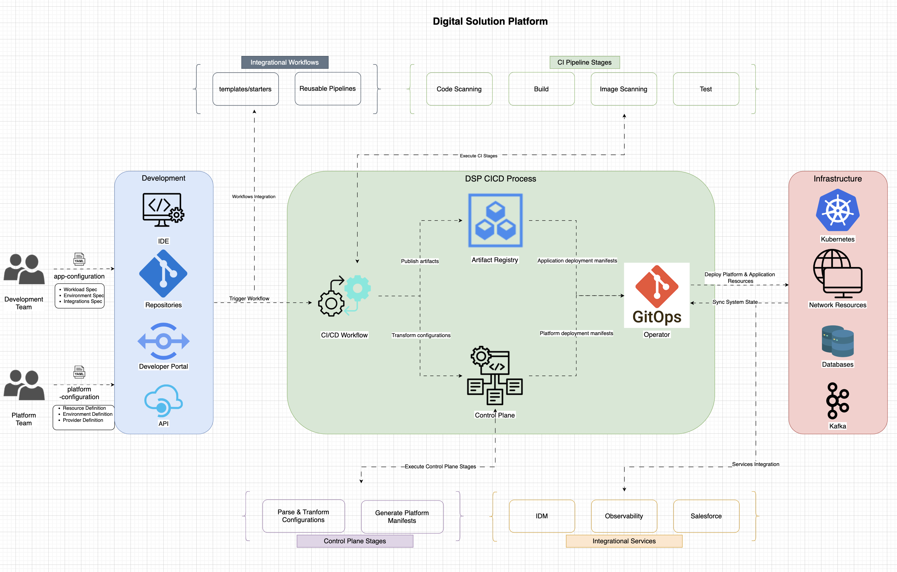

[&larr; back to Overview](/dsp)

**This document will evolve based on future releases**

# DSP - Digital Solution Platform

As DSP, we enable the Vaillant Group to use UI, CLI, IDE,
to easily develop new applications in standarized way.

With the DSP, cluster and application deployment will be easier,
as it come with a standarized way of doing that,
with a set of tools and best practices prebuilt.

Key benefits of DSP:
1. Developer Enablement - Developers can focus on writing code, not on setting up infrastructure. Developers can spin up Kubernetes clusters confidentely, reducing risk of misconfiguration or errors.
2. Organizational efficiency - Standarized way of deploying applications, with a set of tools and best practices prebuilt.

The problem of incosistent environment is solved with standarization process,
developers may apply the same process to all environments,
and the process is repeatable.

By using a standard process,
the risk of misconfiguration or errors is reduced,
the processes follow best practices,
and security patches are applied by DSP Team to all clusters.

---

# Development Environment (Developer Tools provided by DSP)
1. Application Config File (YAML) - describes the application, developers want to deploy. We take care of the logic, behind it. Developers can focus on writing code, not on setting up infrastructure.
2. Platform Config files - describes the platform, where the application will be deployed. Developers just specify what resources do they need, and we take care of the rest. (e.g. Postgres database, Redis cache, Java application, etc.)
3. Future: Developer Portal - in future, will be a place where developers can see their applications, and manage them using UI.

---

# What we offer?
1. Standarized CI/CD pipelines (GitHub Workflows) - [Reusable Workflows Repository](https://github.com/Digital-Solutions-Foundation/reusable-workflows).
2. Automated Infrastructure Provisioning via Application Config Files, Platform Config Files, in future Developer Portal. [Link to repository with Config Files](https://github.com/Digital-Solution-Platform/gitops-digital-solution-platform)
3. Automated application deployment across multi environments using GitOps approach.

### Infrastructure

On a very high level,
we provide infrastructure like shared Kubernetes Resources (clusters, databases, etc) of one Cotrol Plane and multiple Environment Clusters,
which are Kubernetes clusters assigned to indivdual Tenants like VI-..., IR-...
These clusters are shared across multiple teams (projects) with namespaces for each environment.

The Spokes interact with Control Plane,
to collect source of truth,
to have a standarization across all clusters and applications in our organization.

The Spoke Clusters have implemented self-healing mechanisms,
and are monitored by the hub,
which makes them more reliable.

The Control Plane is responsible for deploying workloads into the spokes,
as well as provisioning new spokes.

---

## High level architecture of DSP

Image above shows how we want to formulate the configuration file from the Developer input, for e.g. cloud resources.

See more at [our Confluence Page](https://groupspace.vaillant-group.com/display/VIXP/Digital+Solution+Platform+Architecture).

# Technical Overview

Teams have:
- application code repo (for code of application)
- application gitops repo (for configuration of infrastructure)

Application code repo is a place,
where developers write magic configuration files,
which are then used by the DSP to provision infrastructure.

Application gitops repo is a place,
where developers write configuration files,
which are then used by the DSP to deploy applications.

If you want to see an example structure of the application gitops repo see
[DSP MVP GitOps Repository](https://github.com/Digital-Solution-Platform/gitops-digital-solution-platform).
